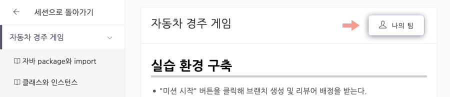
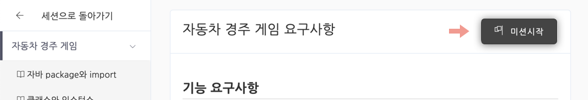
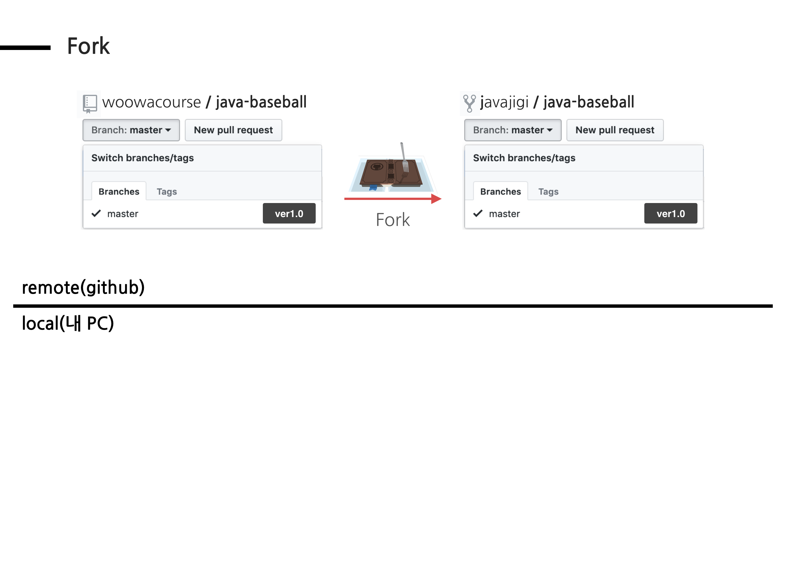
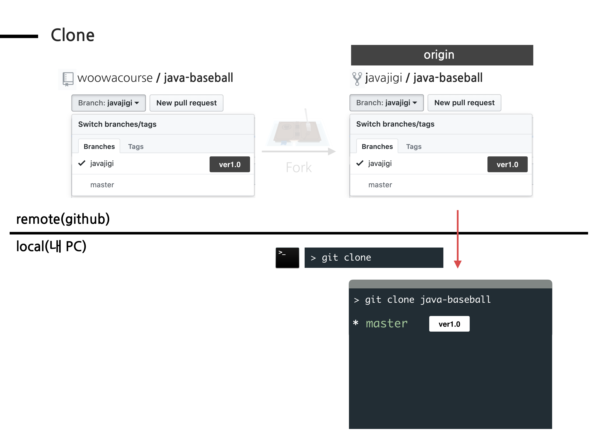
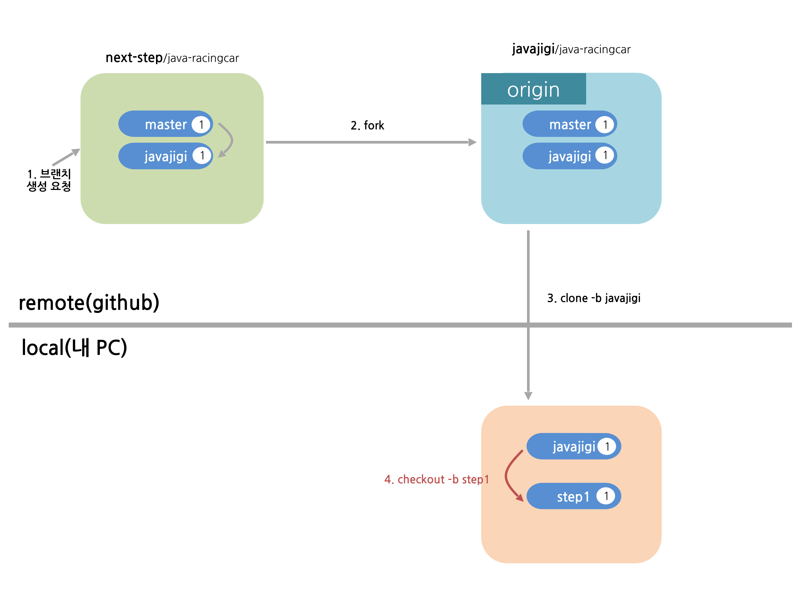
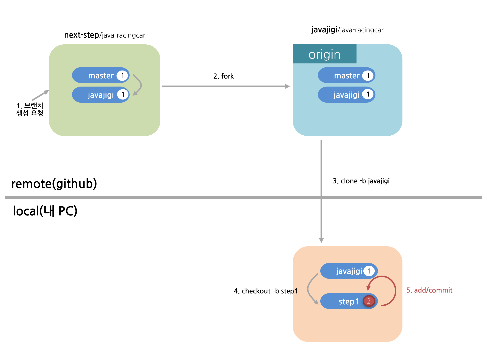
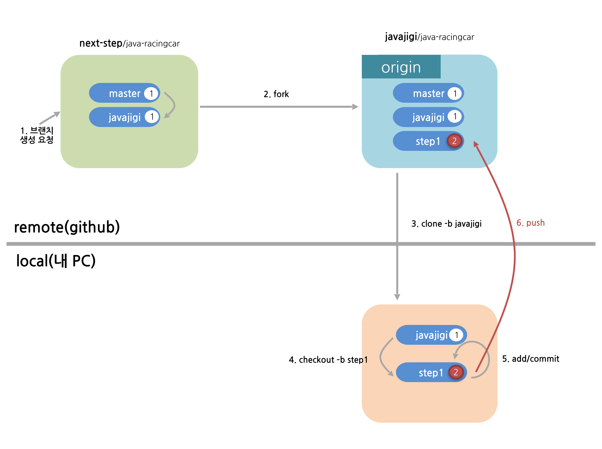

## 코드리뷰 1단계

코드리뷰 1단계는 교육생끼리 팀을 맺어 코드 리뷰를 진행하고 피드백을 주는 단계까지의 과정을 다룬다.

---

1. [강의관리시스템](https://techcourse.woowahan.com)에 로그인한 후 학습할 미션으로 이동한다. 제목 옆에 깃발 아이콘이 있는 것이 미션이다.
   

---

2. 팀 관리 메뉴를 클릭해 같이 활동할 팀원이 있는지 확인한다. 팀원이 없으면 팀 배정 요청을 한다.
   

---

3. 미션으로 이동해 미션 시작 버튼을 클릭해 미션을 시작한다. 미션을 시작하면 저장소 브랜치에 자신의 github 아이디에 해당하는 브랜치가 생성된다. 브랜치가 없는 경우 강사에게 브랜치 생성을 요청한다.
   

---

4. 프로젝트를 자신의 계정으로 fork한다. 저장소 우측 상단의 fork 버튼을 클릭해 fork한다.

> woowacourse 저장소에 코드를 추가할 권한이 없기 때문에 구현한 코드를 추가할 수 없다.
>
> fork는 woowacourse의 저장소를 자신의 계정으로 복사하는 기능이다. 앞으로 모든 미션은 자신의 계정 아래에 있는 저장소를 활용해 진행한다.

다음 그림과 같이 woowacourse 저장소 우측 상단의 fork 버튼을 클릭해 fork한다.


fork를 완료한 후의 저장소 상태는 다음과 같다.


---

5. fork한 저장소를 자신의 컴퓨터로 clone한 후 폴더로 이동한다.

> fork한 저장소는 github.com에 존재하기 때문에 소스 코드를 추가하고, 수정하는 작업을 할 수 없다.
>
> clone 명령은 github.com에 존재하는 저장소를 자신의 노트북 또는 PC로 복사하는 과정이다.

터미널에서 다음 명령을 입력한다.

```
git clone -b {본인_아이디} --single-branch https://github.com/{본인_아이디}/{저장소 아이디}
ex) git clone -b javajigi --single-branch https://github.com/javajigi/java-baseball.git
```

```
// clone한 폴더로 이동하는 방법
cd {저장소 아이디}
ex) cd java-baseball
```

clone을 완료한 후의 저장소 상태는 다음과 같다.


---

6. 기능 구현을 위한 브랜치 생성

> git은 서로 다른 작업을 하기 위한 별도의 공간을 생성할 때 브랜치를 생성할 수 있다.
>
> 브랜치를 생성하는 이유는 실무에서 프로젝트를 진행할 때와 같은 방법으로 기능을 구현하고, 리뷰하는 경험을 전달하기 위함이다.

* 터미널에서 다음 명령을 입력해 브랜치를 생성한다.

```
git checkout -b 브랜치이름
ex) git checkout -b step1
```

* 브랜치를 생성한 후의 상태는 다음과 같다.



---

7. 통합개발도구(Eclipse 또는 IntelliJ)로 가져오기(import)

> 미션 진행을 위해 자신이 사용하고 있는 통합개발도구로 가져오기 한다. 이 문서는 IntelliJ를 기준으로 한다.

* IntelliJ를 시작
* 다음 화면에서 Import Project


* 앞에서 clone한 폴더를 선택한다.
* 다음 화면과 같이 "Import Project from external model" 선택 -> Gradle을 선택 -> Next


* 다음 화면에서 Finish 버튼을 클릭해 가져오기를 완료한다.

---

8. 기능 구현

> [techcourse.woowahan.com](https://techcourse.woowahan.com) 에서 미션 요구사항을 파악해 기능을 구현한다.

---

9. 기능 구현 후 add, commit

> 기능 구현을 완료한 후 로컬 저장소에 변경된 부분을 반영하기 위해 add, commit 명령을 사용한다.

```
git status // 변경된 파일 확인
git add -A(또는 .) // 변경된 전체 파일을 한번에 반영
git commit -m "메시지" // 작업한 내용을 메시지에 기록
```

기능 구현을 완료하고 add, commit 명령을 실행한 후의 상태는 다음과 같다.


---

10. 본인 원격 저장소에 올리기

> 로컬에서 commit 명령을 실행하면 로컬 저장소에만 반영되고, 원격 github.com의 저장소에는 반영되지 않는다.

```
git push origin 브랜치이름
ex) git push origin step1
```

push 명령을 실행한 후의 상태는 다음과 같다.


---

11. 미션 요구사항 구현을 완료한 후 팀 관리 메뉴를 클릭해 교육생 간의 상호 평가를 진행한다.

> 교육생 간의 상호 평가를 진행하면 팀이 분리된다.

---

12. 팀을 분리한 후 개인별로 추가 구현할 부분이 있으면 추가 구현한 후 [코드리뷰 요청 2단계](./review-step2.md)를 진행한다.

