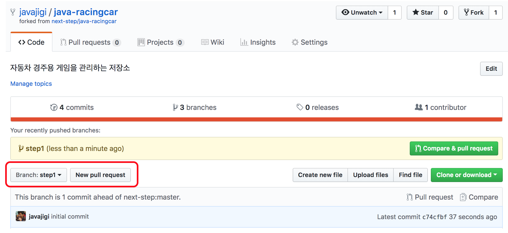
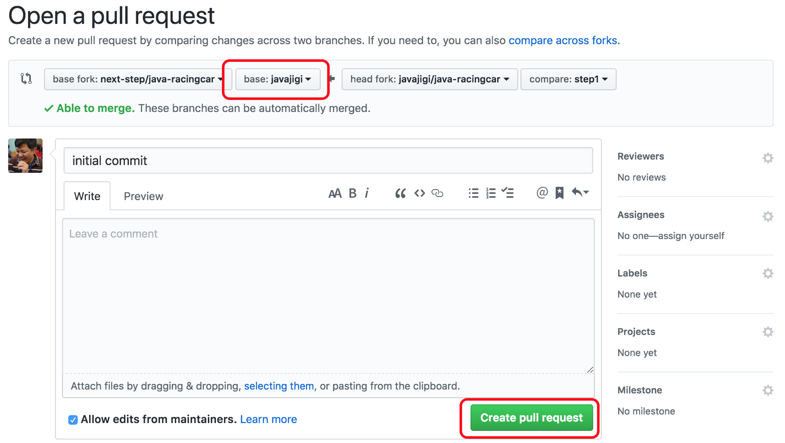
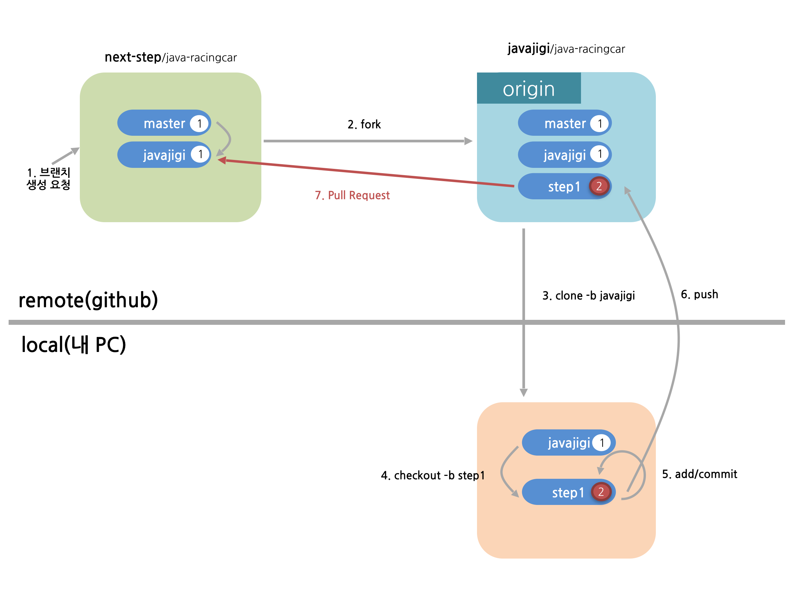
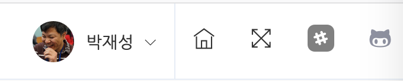
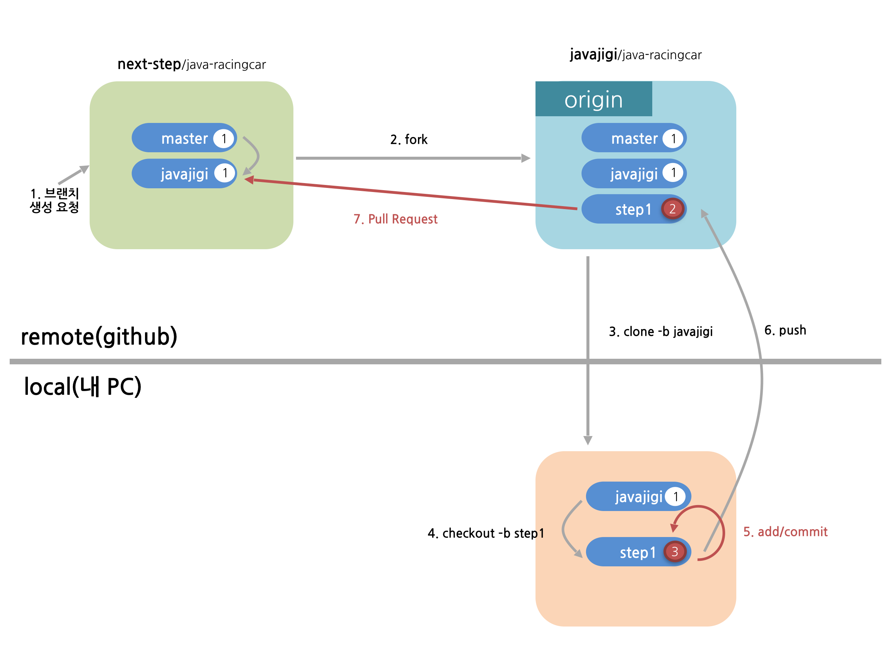

## 코드리뷰 2단계
코드리뷰 2단계는 교육생끼리 리뷰를 끝내고 리뷰어에게 리뷰를 요청하고 피드백을 받는 단계이다.

---
1. github 서비스에서 pull request를 보낸다.
> pull request는 github에서 제공하는 기능으로 코드리뷰 요청을 보낼 때 사용한다.
> 
> pull request는 original 저장소(woowacourse의 저장소)의 javajigi 브랜치와 앞 단계에서 생성한 브랜치 이름(앞 단계의 예에서는 javajigi)을 기준으로 한다.

```
ex) 미션을 진행한 javajigi/java-baseball javajigi 브랜치 
=> woowacourse/java-baseball javajigi 브랜치로 pull request를 보낸다.
```

* 브라우저에서 github 저장소에 접근한다.
* 브랜치를 작업 브랜치로 변경한다(앞 단계의 예에서는 javajigi).
* 브랜치 오른쪽에 있는 "New pull request" 버튼을 클릭한다.



* 현재 미션에서 작업한 내용을 입력하고 "Create pull request" 버튼을 클릭해 pull request를 보낸다.



pull request를 보냈을 때의 상태는 다음과 같다.


---
2. PR을 보낸 후 강의관리시스템의 리뷰요청 버튼을 클릭해 리뷰요청을 보낸다.
> 리뷰요청을 하면 slack을 통해 리뷰어에게 리뷰요청에 대한 알림이 간다.



---
3. pull request에 대해 승인이 되지 않고 수정 요청 피드백을 받으면 피드백 받은 내용을 반영한다. 만약, pull request가 승인이 되어 next-step 저장소에 통합(merge)이 된다면 [코드리뷰 요청 3단계](./review-step3.md)를 진행한다.

---
4. 피드백을 반영한 후 add, commit, push 명령을 실행한다.
> **pull request를 보내 피드백을 받은 후 add, commit, push를 한 후 새로운 pull request를 보내지 않아도 된다.**
>
> 앞서 보낸 pull request가 통합(merge)되지 않은 상태이기 때문에 같은 pull request를 재활용한다.

```
git status // 변경된 파일 확인
git add -A(또는 .) // 변경된 전체 파일을 한번에 반영
git commit -m "메시지" // 작업한 내용을 메시지에 기록
```

```
git push origin 브랜치이름
ex) git push origin step1
```

* 새롭게 add, commit을 진행하는 경우 새로운 버전이 생성되어 상태는 다음과 같다.



* 새로운 버전을 push한 상태는 다음과 같다.


---
5. 강의관리시스템의 리뷰요청 버튼을 클릭해 리뷰요청을 보낸다.


---
6. 몇 번의 피드백을 주고 받은 후 승인이 되어 next-step 저장소에 통합(merge)이 된다면 [코드리뷰 요청 3단계](./review-step3.md)를 진행한다.

* pull request가 승인이 되어 통합이 된 후의 상태는 다음과 같다.


## 2단계를 모두 완료하면 [코드리뷰 요청 3단계](./review-step3.md) 를 진행한다.
