# 프리코스 과제 가이드
## 진행 가이드

---
### 1. 프로젝트를 자신의 계정으로 fork하기
> woowacourse 저장소에 쓰기 권한이 없기 때문에 구현한 코드를 추가할 수 없습니다.
> 
> fork는 woowacourse의 저장소를 자신의 계정으로 복사하는 기능입니다.    
  앞으로 모든 미션은 같은 방식으로 자신의 계정 아래에 있는 저장소를 활용해 진행해주세요.

* 이미지와 같이 woowacourse 저장소 우측 상단의 fork 버튼을 클릭해 fork합니다.
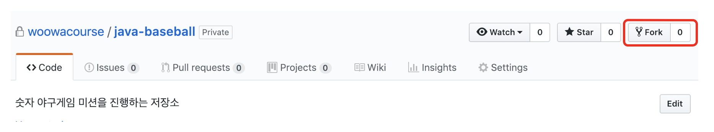

* fork를 완료한 후의 저장소 상태는 아래와 같습니다.
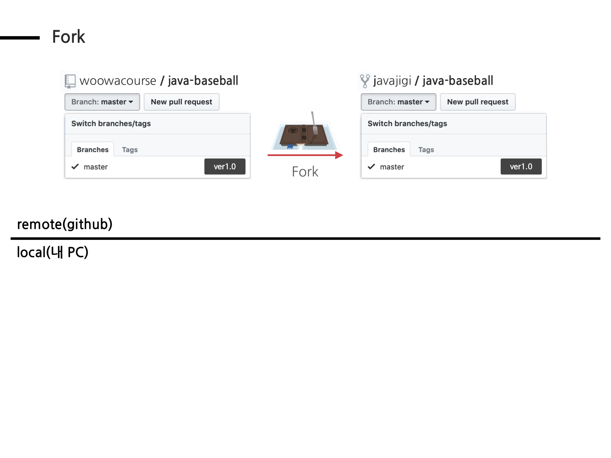

---
### 2. fork한 저장소를 자신의 컴퓨터로 clone하기
> fork한 저장소는 github.com에 존재하기 때문에 소스 코드를 추가하고, 수정하는 작업을 할 수 없습니다.
>
> clone 명령은 github.com에 존재하는 이 저장소를 자신의 노트북 또는 PC로 복사하는 과정입니다.

* 터미널에서 다음 명령을 입력합니다.

```
git clone https://github.com/{본인_아이디}/{저장소 아이디}.git
ex) git clone https://github.com/woowacourse/java-baseball.git
```

```
// clone한 폴더로 이동하는 방법
cd {저장소 아이디}
ex) cd java-baseball
```

* clone을 완료한 후의 저장소 상태는 아래와 같습니다.
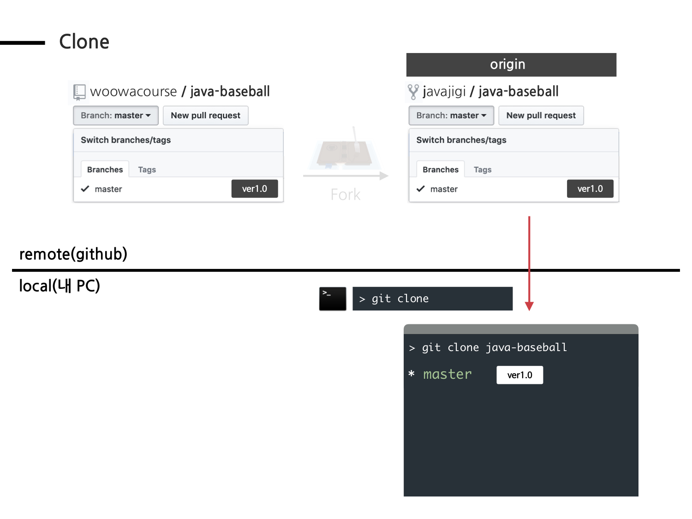

---
### 3. 기능 구현을 위한 브랜치 생성
> git은 서로 다른 작업을 하기 위한 별도의 공간을 만들기 위해 브랜치를 생성할 수 있습니다.

* 터미널에서 다음 명령을 입력해 브랜치를 생성합니다.

```
git checkout -b {브랜치이름}
ex) git checkout -b javajigi
```

* 브랜치를 생성한 후의 상태는 다음과 같다.


---
### 4. 통합 개발 환경(IDE)으로 가져오기
> 미션 진행을 위해 clone한 저장소를 자신이 사용하고 있는 통합 개발 환경(IDE)으로 가져옵니다.

### 4.1 웹 백엔드
> Eclipse 또는 IntelliJ 등 자신이 사용하는 도구를 사용해서 진행해주세요. 이 문서에서는 IntelliJ를 기준으로 설명합니다.    

* IntelliJ를 시작
* 다음 화면에서 Import Project

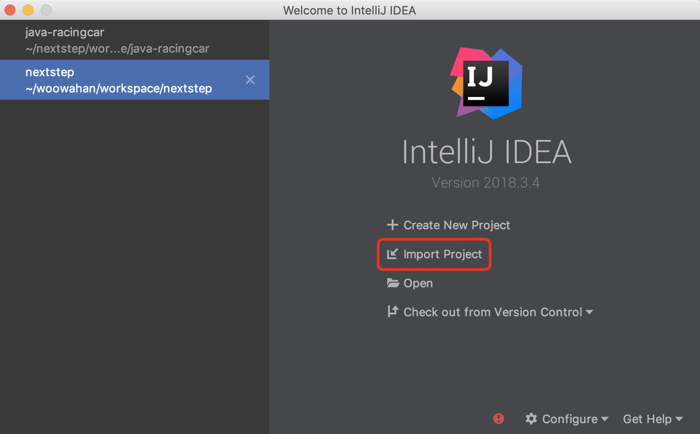

* 앞에서 clone한 폴더 선택
* 다음 화면과 같이 "Import Project from external model" 선택 -> Gradle을 선택 -> Next

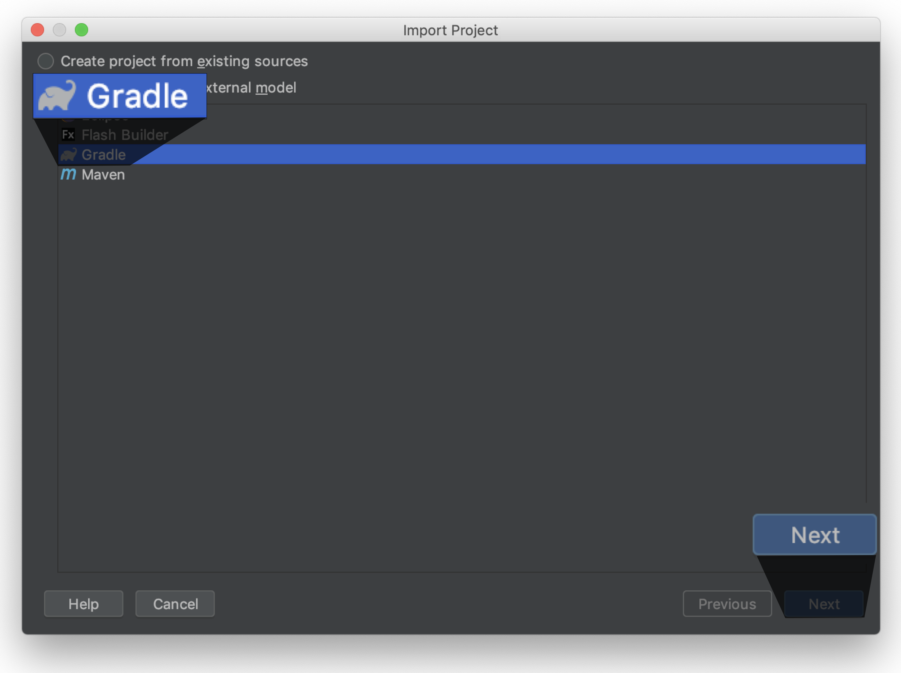

* 다음 화면에서 Finish 버튼을 클릭해 가져오기를 완료합니다.

### 4.2 웹 프론트엔드
> 자신이 사용하는 도구를 사용해서 진행해주세요. 이 문서에서는 Visual Studio Code를 기준으로 설명합니다.    

* Visual Studio Code를 시작
* Open Project 

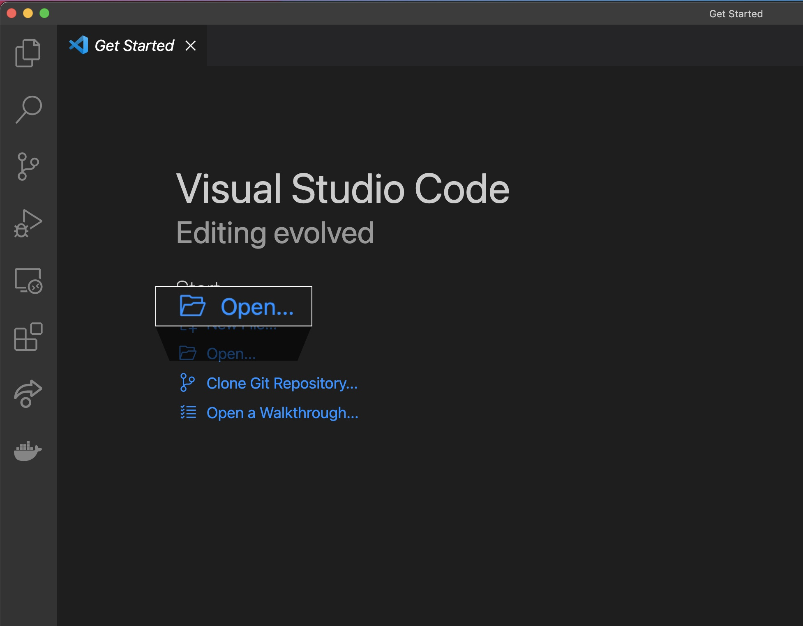

* 앞에서 clone한 폴더를 선택합니다.

---
### 5. 기능 구현
> 미션 요구사항을 파악해 기능을 구현합니다.

---
### 6. 기능 구현 후 add, commit
> 기능 구현을 완료한 후 로컬 저장소에 변경된 부분을 반영하기 위해 add, commit 명령을 사용합니다.

```
git status // 변경된 파일 확인
git add -A(또는 .) // 변경된 전체 파일을 한번에 반영
git commit -m "메시지" // 작업한 내용을 메시지에 기록
```

* 기능 구현을 완료하고 add, commit 명령을 실행한 후의 상태는 아래와 같습니다.
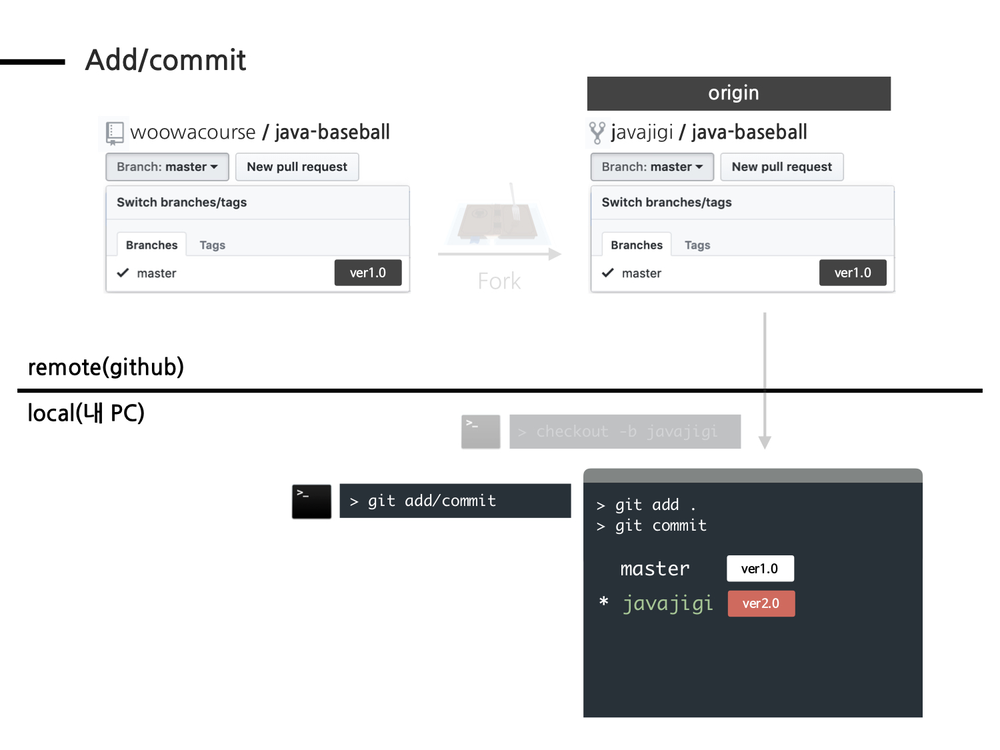

---
### 7. 본인 원격 저장소에 올리기
> 로컬에서 commit 명령을 실행하면 로컬 저장소에만 반영되고, 원격 github.com의 저장소에는 반영되지 않습니다.     
  github.com의 저장소에도 동일하게 반영하기 위해 push 명령어를 사용합니다.

```
git push origin 브랜치이름
ex) git push origin javajigi
```

* push 명령을 실행한 후의 상태는 아래와 같습니다.


---
### 8. github 서비스에서 Pull Request를 보낸다.
> Pull Request는 github에서 제공하는 기능으로 코드리뷰 요청을 보낼 때 사용합니다.
> 
> Pull Request는 original 저장소(woowacourse의 저장소)의 main 브랜치와 앞 단계에서 생성한 브랜치 이름(앞 단계의 예에서는 javajigi)을 기준으로 합니다.

```
ex) 미션을 진행한 javajigi/java-baseball javajigi 브랜치 => woowacourse/java-baseball main
브랜치로 Pull Request를 보낸다.
```

* 브라우저에서 github 저장소에 접근
* 브랜치를 작업 브랜치로 변경(앞 단계의 예에서는 javajigi)
* 브랜치 오른쪽에 있는 **"New pull request"** 버튼 클릭

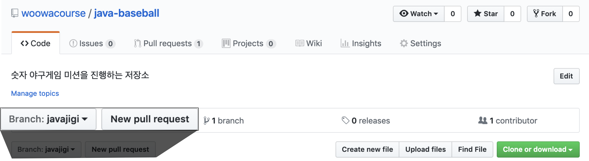

* 현재 미션에서 작업한 내용을 입력하고 **"Create pull request"** 버튼을 클릭해 Pull Request를 보내주세요.

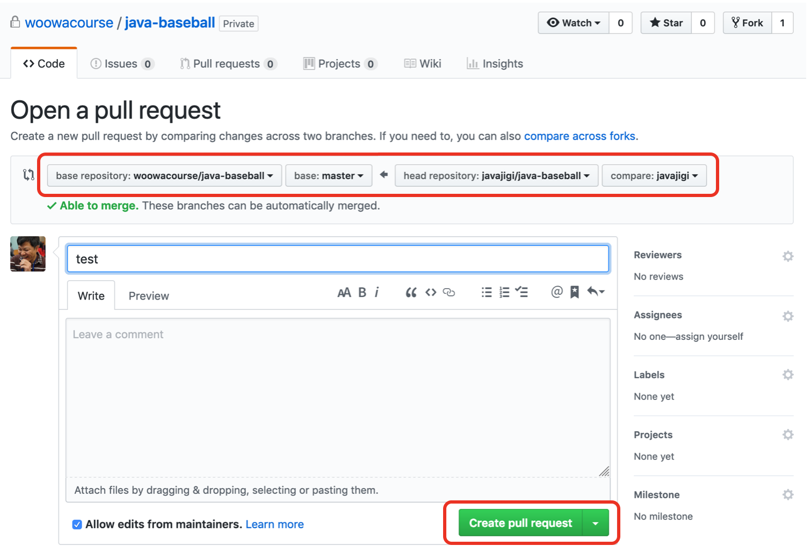

* Pull Request를 보냈을 때의 상태는 아래와 같습니다.

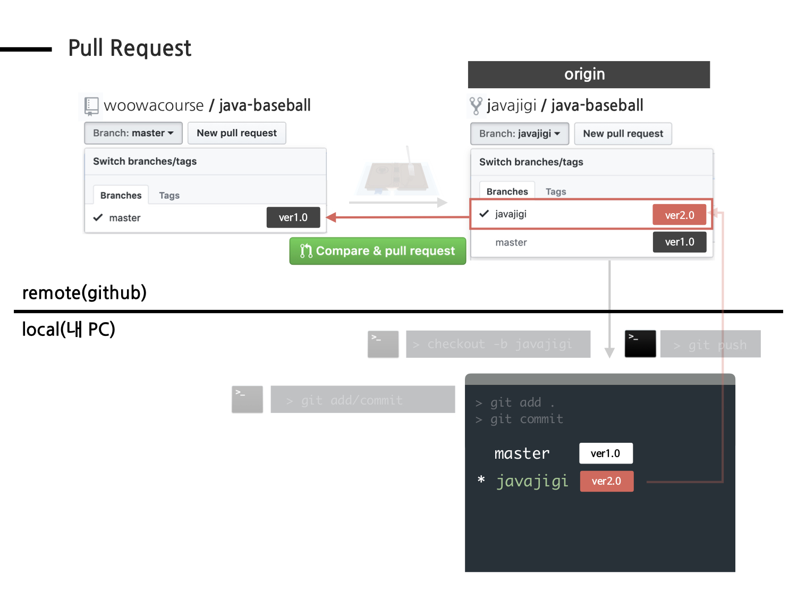

--- 
<br/>

## 제출 가이드
이전 단계의 가이드에 따라 Pull Request를 보냈다면,     
[우아한테크코스 지원 플랫폼](https://apply.techcourse.co.kr)에 접속하여 프리코스 과제를 제출해 주세요.    
**Pull Request만 보내고, 지원 플랫폼에서 과제를 제출하지 않으면 최종 제출하지 않은 것으로 처리되니 주의해 주세요.**    

### 1. [우아한테크코스 지원 플랫폼](https://apply.techcourse.co.kr) > 내 지원 현황
지원 플랫폼에 로그인한 뒤, 내 지원 현황 페이지에 접속해 주세요.      
내가 지원한 과정(ex. 웹 백엔드 / 웹 프론트엔드)에 프리코스 과제가 생긴 것을 확인하실 수 있습니다.    

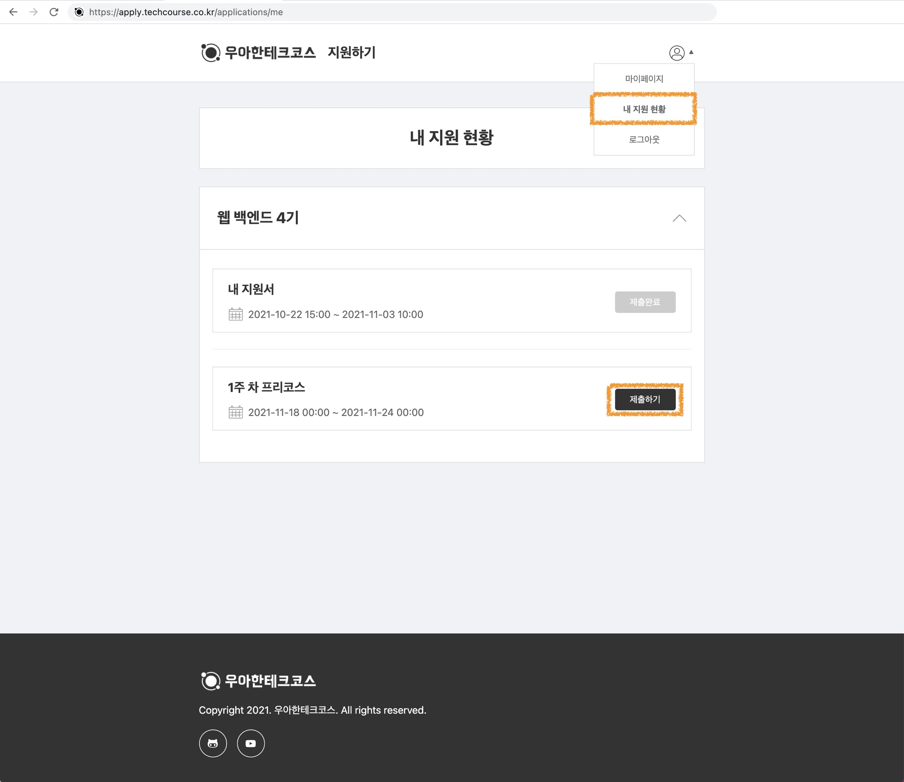 

---
### 2. 프리코스 과제 제출
GitHub ID, Pull Request 주소, 과제 진행 소감을 모두 입력하고 제출해 주세요.      
과제 진행 소감에는 미션을 진행하면서 느끼고 배운 점, 많은 시간을 투자한 부분 등도 포함하면 더 좋을 것 같습니다. 🙂
- 한 번 제출한 뒤에도 해당 주차의 프리코스 기한 내에는 수정하실 수 있습니다.
- GitHub ID에는 아래 이미지를 참고해 GitHub username을 확인하여 입력해 주세요.    

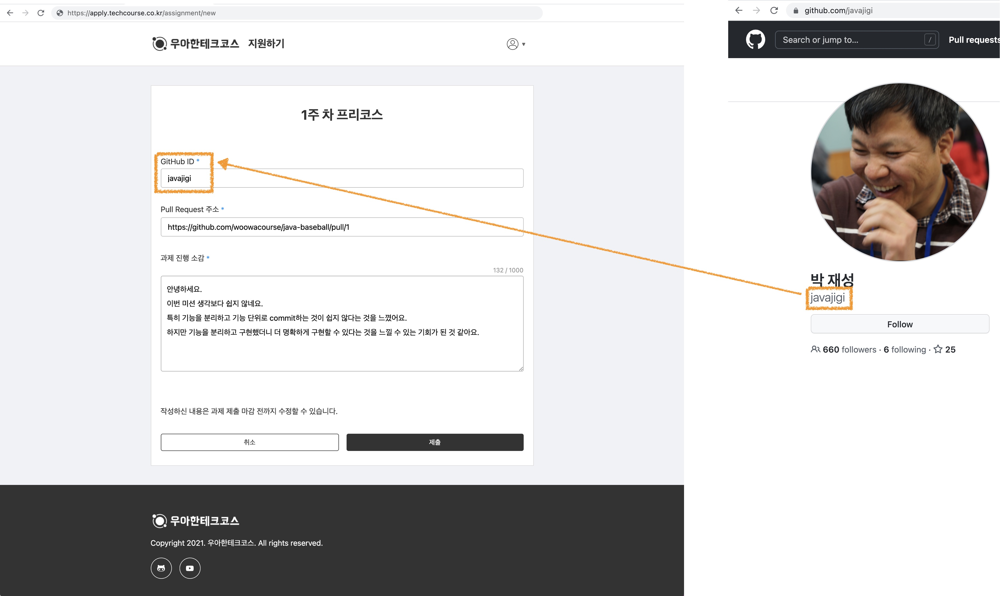

