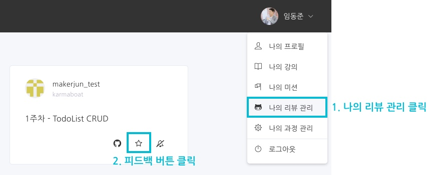
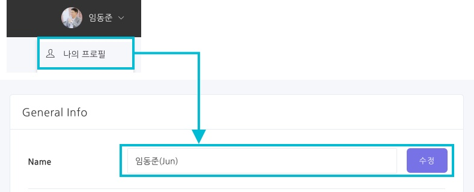
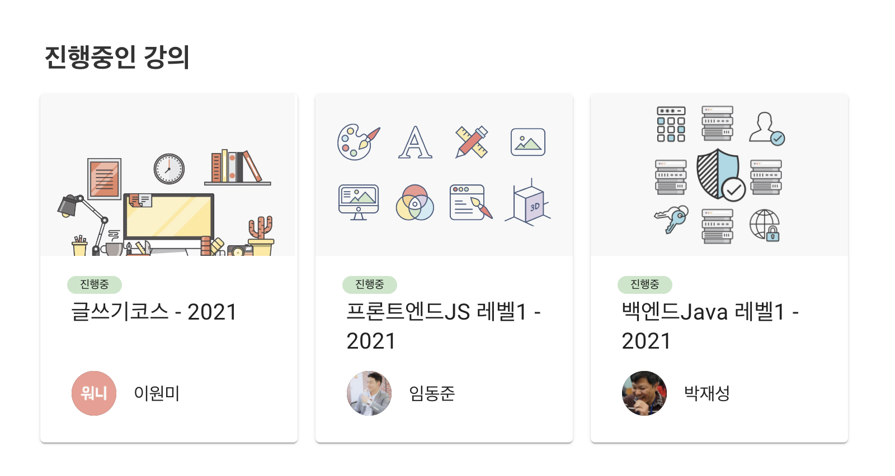
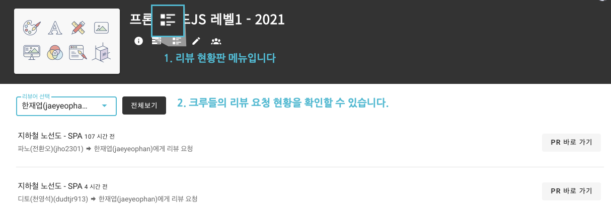
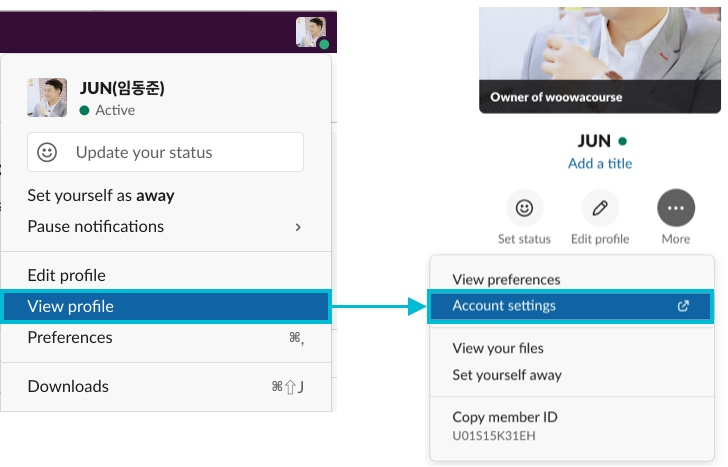
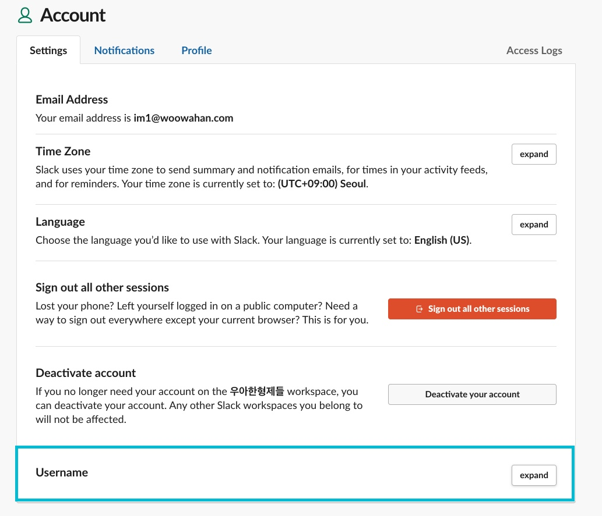
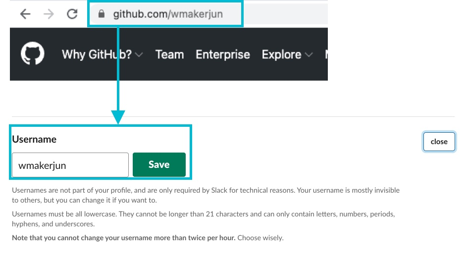
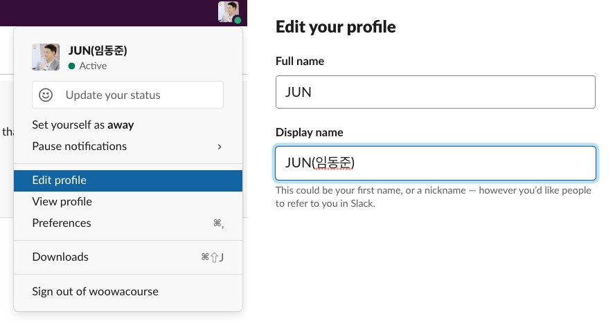

우아한테크코스는 총 4단계의 레벨로 과정이 진행됩니다.
리뷰어분들은 레벨1~2 기간 동안 미션마다 크루들에게 피드백을 남기며 소통하는 역할을 맡습니다. 
각 미션 진행 시 이해를 돕기 위한 가이드라인을 드릴 예정입니다. 
하지만 리뷰어분들의 개성에 맞게 피드백을 주시면 학생들이 훨씬 다각도의 관점으로 고민하고 성장할 수 있습니다. 
피드백을 통해 대화한다고 생각해주세요.

 

# 🗓️ 일정
- 레벨1 - 약 9주: 2/2 ~ 4/2(일정은 매해 다소 상이함)
- 레벨2 - 약 8주: 4/13 ~ 6/4(일정은 매해 다소 상이함)

 

# 🚀 미션 구성 계획
미션은 참고용으로, 달라질 수 있습니다.

## 백엔드
### 레벨1 - Java를 이용한 애플리케이션 개발
- [자동차 경주 게임](https://github.com/woowacourse/java-racingcar)
- [로또](https://github.com/woowacourse/java-lotto)
- [블랙잭](https://github.com/woowacourse/java-blackjack)
- [체스](https://github.com/woowacourse/java-chess)

### 레벨2 - Spring을 이용한 애플리케이션 개발
- [지하철 노선도 어드민](https://github.com/woowacourse/java-subway-map-precourse)
- [지하철 노선도 사용자 페이지](https://github.com/woowacourse/java-subway-path-precourse)

 

## 프론트엔드
### 레벨1 - VanillaJS를 이용한 애플리케이션 개발

- [자동차 경주 게임](https://github.com/woowacourse/javascript-racingcar)
- [로또](https://github.com/woowacourse/javascript-lotto)
- [나만의 유튜브 강의실](https://github.com/woowacourse/javascript-youtube-classroom)
- [지하철 노선도](https://github.com/woowacourse/javascript-subway)

### 레벨2 - React를 이용한 애플리케이션 개발

 

# 💬  리뷰 진행 방법
- 페어(2명의 크루)가 미션을 진행하고 1단계 요구사항에 대해 PR을 보냅니다.
- PR에 대해 피드백을 남겨주시고 `Request Changes` 요청을 합니다.
    - 근무일 기준 오후 4시 이전에 요청한 코드 리뷰는 리뷰 요청한 날 리뷰하는 것을 목표로 합니다.
    - 근무일 기준 오후 4시 이후에 요청한 코드 리뷰는 다음 날까지 리뷰하는 것을 목표로 합니다.
    - 만약 불가피한 상황으로 인해 리뷰 진행이 어렵다고 하면, 운영진에게 도움을 요청해주세요!
- 페어는 해당 피드백을 반영하여 추가 커밋을 진행 후 [LMS](https://techcourse.woowahan.com/) 에서 리뷰요청을 하고, 슬랙으로 알림이 옵니다.
- 리뷰어님은 피드백이 반영된 것을 확인하시고, 추가 피드백을 주시거나  `Squash and merge` 를 해주시면 됩니다.
- 페어는 PR이 merge된 후에 나머지 요구사항을 혼자 구현한 후 다음 단계의 PR을 보냅니다.
    - 페어로 진행하는 미션 단계가 1단계만일 수도, 2단계까지일 수도 있습니다. 미션마다 상이한 부분이 있어 미션 시작할 때 함께 공유드리겠습니다.
- 이 PR에 대해서도 동일하게 피드백 후  `Request Changes`  &  `Squash and merge` 를 해주시면 됩니다.
- 미션을 최종 마무리한 후에는 해당 크루에 대한 마무리 피드백을 해주셔야 합니다. 우테코는 피드백을 굉장히 중요하게 생각하는데요. 리뷰어분들이 작성해주시는 이 피드백을 운영진들이 취합하여 면담 시 크루들의 성장에 도움이 될 수 있게 활용하곤 합니다. 크루들에게 직접적으로 공개되진 않으니 편하게, 솔직하게 작성해주시면 될 것 같습니다. 시스템적으로도 리뷰어분들의 피드백이 있어야 크루들이 미션을 최종적으로 완료한 거로 처리되니 꼭 부탁드리겠습니다

 

# ⚙️ 환경 셋팅
## 우아한테크코스 LMS 셋팅
1. [우아한테크코스 LMS](https://techcourse.woowahan.com/)에 깃허브 로그인으로 가입해주세요.
2. '프로필 이미지 > 나의 프로필'로 접근해서 이름을 `실명(닉네임)` 형태로 수정해주세요.

3. 프론트엔드 혹은 백엔드 수업에 접근 가능한지 확인해주세요

4. 강의 페이지에서는 실시간 리뷰 요청 현황을 파악할 수 있습니다. 

## 우아한테크코스 Slack 셋팅
1. 우아한테크코스 slack에 로그인해주세요.
2. Username을 아래의 스텝에 따라 수정합니다.
- 2-1. 우측 상단의 프로필을 클릭한후, 계정 설정으로 들어가주세요 

- 2-2. 설정 마지막에 있는 Username 리스트의 `expand` 버튼을 클릭해주세요

- 2-3. Username을 본인의 Github Id로 저장해주세요. 깃허브 아이디는 https://github.com/wmakerjun 와 같은 형태로 접근 가능한 본인의 id입니다.

3. DisplayName을 `닉네임(이름)` 으로 변경합니다.

# 🔗 참고 링크
- [우형 리뷰어분의 후기](https://woowabros.github.io/woowabros/2019/08/22/code-reviewer.html)
- [뉴크루 온보딩 코드 리뷰어로 참여하기](https://tech.kakao.com/2021/04/08/welcome-new-krew3)
