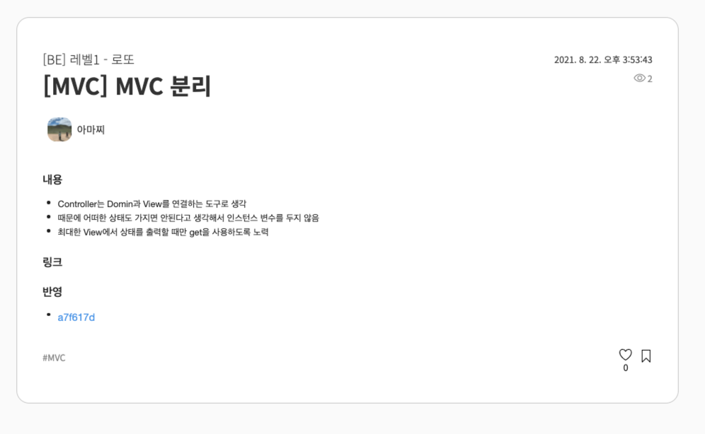
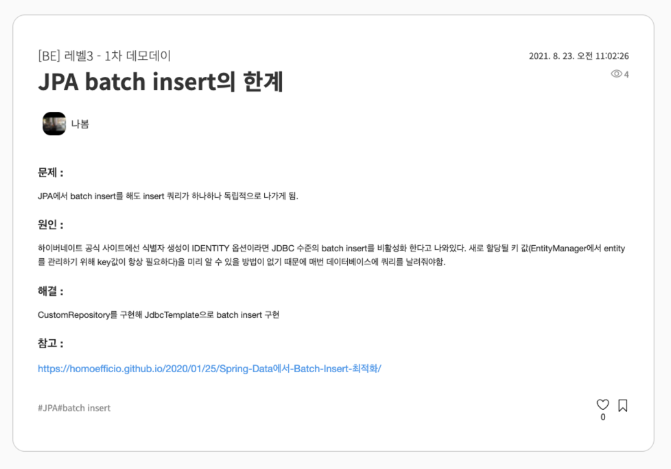
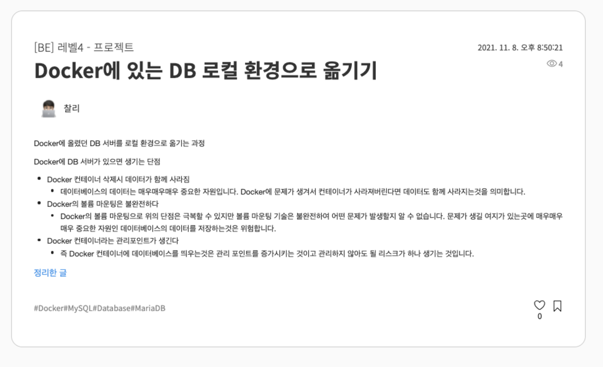

# 학습로그

## 학습로그 작성목적

- 학습한 내용을 글로 작성하면서 알고 있다는 느낌만 가지고 있는지 아니면 정확하게 아는지를 구분하기 위해
- 학습 과정을 기록하여 얼마나 발전하고 있는지 어느 시기엔 어떤 주제를 학습해가고 있는지를 파악하기 위해

## 학습로그 작성 방법

- 학습로그는 미션 단위로 작성
- 강의 혹은 미션 중 학습한 내용에 대해 기록하며 개인적으로 학습한 내용에 대한 기록도 좋음
- 학습로그는 제목, 본문, 태그로 구성

### 제목

- 제목은 학습한 내용의 주제를 입력
- 특별한 규칙은 없고 학습로그가 어떤 내용인지를 알아볼 수 있는 제목이면 좋음

### 본문

- 본문은 학습한 내용을 입력
- 두괄식으로 작성하면 좋으며 학습한 것에 대해 간략하게 먼저 서술하고 이를 뒷받침하는 학습하는 과정이나 느낀점을 후술
- 다양한 주제의 학습을 하나의 학습로그로 묶어서 작성하는 것 보다는 주제에 맞게 나누어 작성하는 것을 추천

### 태그

- 태그는 비슷한 주제의 학습로그를 모아볼 때 활용하며 여러개의 태그를 등록해도 좋음

## 학습로그 작성 시기

- 학습로그는 미션 단위로 작성하며 한 미션에 여러 학습로그를 작성할 수 있음
- 하나의 학습로그에 몰아서 작성하는 것 보다는 주제별로 나누어 작성하는 것을 추천
- 매일 작성하는 방법도 좋고 미션을 마무리 한 다음 회고하면서 어떤 내용을 학습했는지 정리하면서 작성해도 좋음

## 학습로그 작성 팁

- 단순히 정보를 나열하는 블로그 형식을 글 보다는 문제 상황, 문제 해결 방법, 고민했던 흐름 등의 정보를 작성해주는 것이 좋음
- 정보성 문서는 링크로 첨부해도 좋음

## 작성 예시

### 학습 내용 기록

### 문제 해결 기반

### 블로그 첨부

## TODO

- 적절한 예시 3개 정도 추가